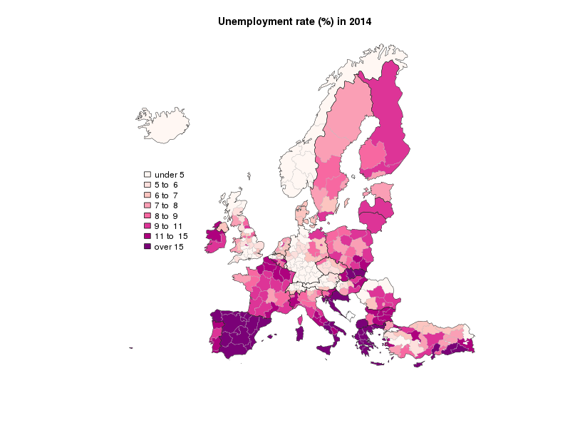

This is a snippet of code to replicate in `R` [an unemployment tracker](http://blogs.ft.com/ftdata/2015/04/17/eu-unemployment-tracker/) published by Financial Times. I wanted in particular to illustrate how easy `rsdmx` renders data processing part. Financial Times graphs were done with `d3`, so obviously there is no intention to compete. [This website](http://rstudio-pubs-static.s3.amazonaws.com/8955_871d064627354ed489b8c28b78ef1d0b.html) was very useful to get the hang of how to get spatial Eurostat data into `R`.

To obtain the map drawing, it suffices to run `Rscript map.R` provided that all the necessary packages are installed.

For completeness, geographic shapefiles are included in `data` directory. Unfortunately, these are not public domain as specified [here](http://ec.europa.eu/eurostat/web/gisco/geodata/reference-data/administrative-units-statistical-units) and commercial usage is prohibited. They are property of **© EuroGeographics for the administrative boundaries**.
